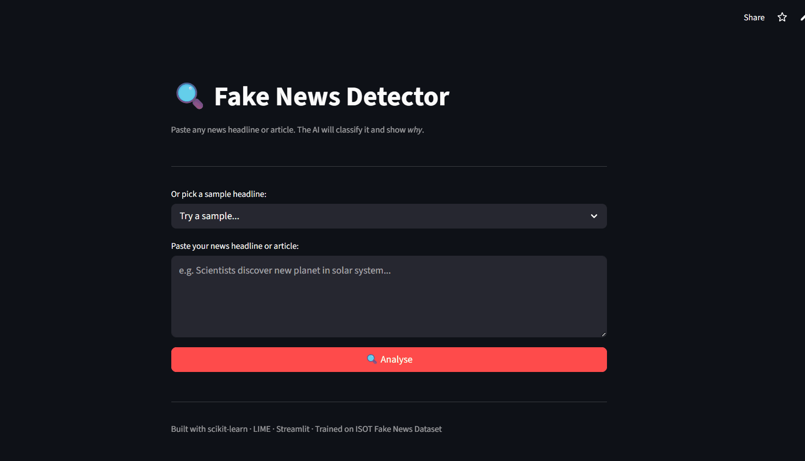

# 🔍 Fake News Detector

> A machine learning web app that classifies news headlines and articles as **Real** or **Fake** — and explains *why* using word-level highlighting.


---

## Demo

<!-- Add your Streamlit Cloud link here after deploying -->
🚀 **Live Demo:** [fake-news-detector.streamlit.app](#)

<!-- Add a GIF of your app here -->


---

## Features

- Paste any news headline or article and get an instant verdict
- Confidence score (0–100%) for each prediction
- Word-level highlighting powered by LIME explainability
- Shows exactly which words pushed the model toward Fake or Real
- Sample headlines included for quick testing

---

## How It Works

```
Raw Text → TF-IDF Vectorizer → Logistic Regression → FAKE / REAL + Confidence
                                                           ↓
                                                     LIME Explainer
                                                           ↓
                                                   Word Importance Scores
```

1. Text is cleaned (lowercased, URLs removed, punctuation stripped)
2. TF-IDF converts words into numerical features (50k features, bigrams)
3. Logistic Regression classifies Real vs Fake with a probability score
4. LIME perturbs the input to find which words changed the prediction most

---

## Tech Stack

| Tool | Purpose |
|------|---------|
| Python | Core language |
| scikit-learn | TF-IDF + Logistic Regression |
| LIME | Model explainability |
| Streamlit | Web UI |
| pandas / numpy | Data processing |
| ISOT Dataset | 44,000 labelled articles |

---

## Installation

```bash
# 1. Clone the repo
git clone https://github.com/YOUR_USERNAME/fake-news-detector.git
cd fake-news-detector

# 2. Create virtual environment
python -m venv venv
source venv/bin/activate        # Windows: venv\Scripts\activate

# 3. Install dependencies
pip install -r requirements.txt

# 4. Download the dataset (see data/download_data.py for instructions)
python data/download_data.py

# 5. Train the model
python model/train.py

# 6. Run the app
streamlit run app.py
```

---

## Dataset

This project uses the **ISOT Fake News Dataset** from the University of Victoria.

- 21,417 real news articles (Reuters)
- 23,481 fake news articles
- Download from [Kaggle](https://www.kaggle.com/datasets/clmentbisaillon/fake-and-real-news-dataset)

---

## Model Performance

| Metric | Score |
|--------|-------|
| Accuracy | ~98% |
| Precision (Fake) | ~98% |
| Recall (Fake) | ~98% |
| F1 Score | ~98% |

---

## Project Structure

```
fake-news-detector/
├── app.py                  # Streamlit web app
├── model/
│   ├── train.py            # Model training
│   ├── predict.py          # Prediction logic
│   ├── explainer.py        # LIME explainability
│   └── saved/              # Saved model files (after training)
├── data/
│   ├── download_data.py    # Dataset helper
│   └── dataset.csv         # Merged dataset (after setup)
├── notebooks/
│   └── exploration.ipynb   # EDA and experiments
├── requirements.txt
└── README.md
```

---

## Deployment

Deployed on **Streamlit Community Cloud** for free:

1. Push your code to GitHub
2. Go to [share.streamlit.io](https://share.streamlit.io)
3. Connect your repo and set `app.py` as the entry point
4. Done — live link in seconds!

---

## Author

Built by [Your Name](https://github.com/YOUR_USERNAME) as a portfolio project.

---

## License

MIT License — feel free to use and modify.